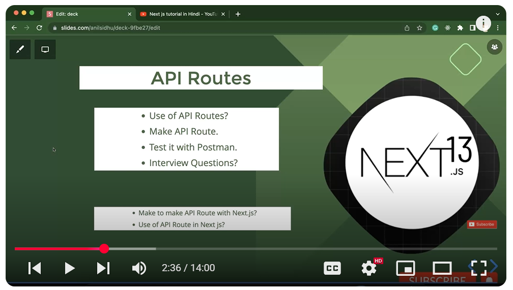
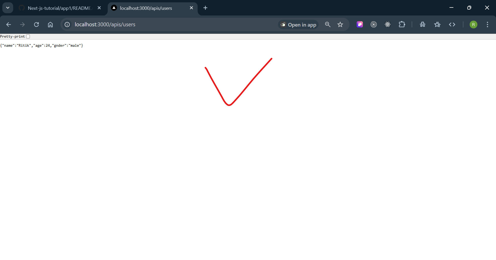
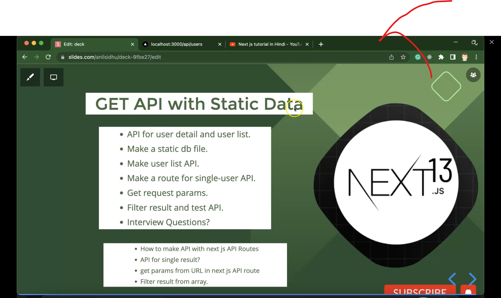

## ------------- Next JS tutorial in Hindi #35 API Routes in Next.js 13.4 ----------
1) 
2) 

## ---------- Next JS tutorial in Hindi #36 GET API with Static Data in API Routes in Next.js 13.4 -------
1) 
2) create a utils folder and inside it create a db.js file where we will store normal static data...
3) 