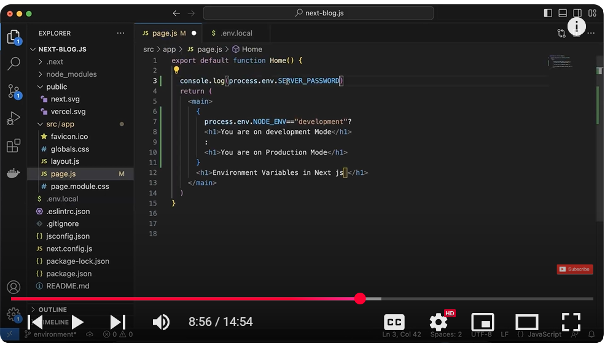
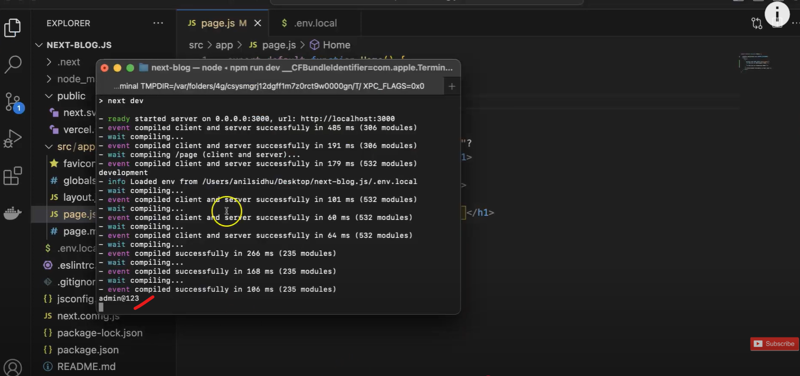

## ---------- Next JS tutorial #33 Redirect | Redirection in Next.js 13.4 ----------
1) if a user go to other page by getting a new endpoint in project then that is called as Redirection and if the user go to other page by clicking on the some action that is called as navigation
2) 
3)  basically we can do redirect using redirect in particular file and we can do it by using config file as well 
4) using file:
  - 
  - 
  - 
## ------ other way using config file: ----
1) 
2) 
3) 
## ------ difference between navigation and redirecation ---------
Great question!

In **Next.js** (and web development in general), **navigation** and **redirection** are two different concepts related to changing pages or URLs. Here's a detailed breakdown:

---

### 🔁 **Navigation**

**Navigation** refers to **manually going from one page to another** — either by clicking a link or programmatically using functions like `router.push()`.

#### ✅ Characteristics:

* **User-initiated** (e.g., clicking a `<Link>`).
* Or **programmatic** (via `router.push()` or `router.replace()`).
* No change in the HTTP status code.
* The current page transitions to a new page.

#### ✅ Example:

```jsx
import Link from 'next/link';

export default function HomePage() {
  return (
    <div>
      <h1>Home</h1>
      <Link href="/about">Go to About Page</Link>
    </div>
  );
}
```

Or programmatically:

```js
import { useRouter } from 'next/router';

const Component = () => {
  const router = useRouter();

  const goToAbout = () => {
    router.push('/about');
  };

  return <button onClick={goToAbout}>Go to About</button>;
};
```

---

### 🔀 **Redirection**

**Redirection** means **automatically forwarding** the user from one URL to another — often without user interaction.

There are two types:

1. **Client-side Redirection**
2. **Server-side Redirection**

#### ✅ Use cases:

* Redirect after login
* Redirect outdated pages to new URLs
* Protecting routes

#### ✅ Example (Next.js):

##### a) **Server-side Redirection** in `getServerSideProps`:

```js
export async function getServerSideProps(context) {
  return {
    redirect: {
      destination: '/login',
      permanent: false, // 307 Temporary Redirect
    },
  };
}
```

##### b) **Middleware-based Redirection (Next.js 13+)**

```js
// middleware.js
import { NextResponse } from 'next/server';

export function middleware(request) {
  const isLoggedIn = false; // your logic
  if (!isLoggedIn) {
    return NextResponse.redirect(new URL('/login', request.url));
  }
  return NextResponse.next();
}
```

---

### 🔍 Key Differences

| Feature          | Navigation                           | Redirection                            |
| ---------------- | ------------------------------------ | -------------------------------------- |
| **Triggered by** | User or programmatic (`router.push`) | Server-side or middleware logic        |
| **Control**      | User-initiated                       | Auto-forwarded                         |
| **Use Case**     | Moving between app pages             | Auth, outdated pages, access control   |
| **Status Code**  | None                                 | 301, 302, 307, 308 (depending on type) |
| **SEO Impact**   | No                                   | Yes (important for 301/302 redirects)  |

---

### ✅ In Summary

* **Navigation** is when a user or app moves to a new route.
* **Redirection** is when the app **automatically sends** the user somewhere else without their input.

---

Let me know if you'd like code examples for both in the same project or for authentication use case.

     -yes: 
Perfect! Let's create a **Next.js demo project** that uses both **navigation** and **redirection** — similar to a mini blog site with authentication-based access control.

---

## 🔧 Project Setup

You can start with:

```bash
npx create-next-app@latest nextjs-nav-redirect-demo
cd nextjs-nav-redirect-demo
npm install
```

---

## 📁 Project Structure Overview

```
/pages
  ├── index.js         --> Public Home Page (navigation)
  ├── blog.js          --> Blog Page (protected)
  ├── login.js         --> Dummy Login Page
  └── _middleware.js   --> Middleware for redirection
```

---

## 🔹 1. `pages/index.js` — Public Home Page with Navigation

```jsx
import Link from 'next/link';

export default function HomePage() {
  return (
    <div>
      <h1>🏠 Welcome to My Blog</h1>
      <Link href="/blog">Go to Blog (Protected)</Link>
      <br />
      <Link href="/login">Login</Link>
    </div>
  );
}
```

---

## 🔹 2. `pages/login.js` — Dummy Login Page with Fake Auth

```jsx
import { useRouter } from 'next/router';

export default function LoginPage() {
  const router = useRouter();

  const handleLogin = () => {
    // Fake login: just store "token" in localStorage
    localStorage.setItem('auth', 'true');
    router.push('/blog'); // navigate to blog page
  };

  return (
    <div>
      <h2>🔐 Login Page</h2>
      <button onClick={handleLogin}>Login</button>
    </div>
  );
}
```

---

## 🔹 3. `pages/blog.js` — Protected Blog Page

```jsx
import { useEffect, useState } from 'react';
import { useRouter } from 'next/router';

export default function BlogPage() {
  const router = useRouter();
  const [isAuth, setIsAuth] = useState(false);

  useEffect(() => {
    const auth = localStorage.getItem('auth');
    if (!auth) {
      router.push('/login'); // redirect if not logged in
    } else {
      setIsAuth(true);
    }
  }, []);

  if (!isAuth) return <p>Checking auth...</p>;

  return (
    <div>
      <h2>📝 Blog Posts</h2>
      <p>This is a protected blog page.</p>
    </div>
  );
}
```

---

## 🔹 4. Optional: Middleware for Redirect (Next.js 13+ or custom logic)

> If you want **server-side redirection** for protected pages, you can create a `middleware.js` in the root or `/pages`.

### 👉 `middleware.js` (Advanced Optional)

```js
// middleware.js (Optional - Next.js 13+ only)
import { NextResponse } from 'next/server';

export function middleware(request) {
  const isAuth = request.cookies.get('auth')?.value;

  if (!isAuth && request.nextUrl.pathname.startsWith('/blog')) {
    return NextResponse.redirect(new URL('/login', request.url));
  }

  return NextResponse.next();
}
```

---

## ✅ Final Test Flow

1. Open `/` → Click "Go to Blog" ➜ Redirects to `/login` (not logged in).
2. Go to `/login` → Click Login ➜ Navigates to `/blog`.
3. `/blog` displays content only when logged in.

---

## 🧠 Summary

| Feature         | Implementation                        |
| --------------- | ------------------------------------- |
| Navigation      | `Link`, `router.push()`               |
| Client Redirect | `router.push()` in `useEffect`        |
| Server Redirect | `middleware.js`, `getServerSideProps` |

---

## ----------- redirection from a component , from config file Dynamic url redirection  -----

In **Next.js**, redirection can be done in **three primary ways**:

1. **From a Component** → using `next/router`
2. **From `next.config.js`** → for static redirects (dynamic possible with patterns)
3. **Dynamic Redirection in Middleware or Server Logic** → for runtime redirects

---

## ✅ 1. Redirection **from a Component** (Client-side)

```jsx
// pages/example.js
import { useEffect } from 'react';
import { useRouter } from 'next/router';

export default function ExamplePage() {
  const router = useRouter();

  useEffect(() => {
    const userIsLoggedIn = false;
    if (!userIsLoggedIn) {
      router.push('/login'); // client-side redirection
    }
  }, []);

  return <h2>Example Page</h2>;
}
```

---

## ✅ 2. Redirection **from next.config.js** (Static or Pattern-Based)

You can define **static or dynamic redirects** here.

### 👉 Example: `next.config.js`

```js
// next.config.js
module.exports = {
  async redirects() {
    return [
      {
        source: '/old-blog', // static redirect
        destination: '/new-blog',
        permanent: true,
      },
      {
        source: '/post/:id', // dynamic redirect
        destination: '/blog/:id',
        permanent: false,
      },
      {
        source: '/user/:path*',
        destination: '/profile/:path*',
        permanent: false,
      },
    ];
  },
};
```

> ✅ Restart your dev server after updating `next.config.js`

* `/post/123` → `/blog/123`
* `/user/settings/profile` → `/profile/settings/profile`

---

## ✅ 3. Dynamic Redirection from Middleware (Runtime-based)

### 👉 Example: `middleware.js`

```js
import { NextResponse } from 'next/server';

export function middleware(request) {
  const url = request.nextUrl;

  // Redirect if not authenticated
  if (url.pathname === '/dashboard') {
    const isAuth = request.cookies.get('auth')?.value;
    if (!isAuth) {
      return NextResponse.redirect(new URL('/login', request.url));
    }
  }

  // Dynamic redirect condition
  if (url.pathname === '/coming-soon') {
    return NextResponse.redirect(new URL('/maintenance', request.url));
  }

  return NextResponse.next();
}
```

> Place `middleware.js` in the root or inside `/src`

---

## Bonus: Redirection from `getServerSideProps`

You can perform **dynamic server-side redirection** like this:

```js
// pages/admin.js
export async function getServerSideProps(context) {
  const { req } = context;

  const isAdmin = false;
  if (!isAdmin) {
    return {
      redirect: {
        destination: '/unauthorized',
        permanent: false,
      },
    };
  }

  return {
    props: {}, // will be passed to the page component
  };
}

export default function AdminPage() {
  return <h1>Admin Dashboard</h1>;
}
```

---

## 🧠 Summary Table

| Type                 | Where?            | Use For                              |
| -------------------- | ----------------- | ------------------------------------ |
| `router.push()`      | In components     | Client-side redirect                 |
| `next.config.js`     | Static file       | Pattern-based redirects              |
| `getServerSideProps` | Page-level export | Dynamic, server-based user checking  |
| `middleware.js`      | Root/middleware   | Runtime URL inspection + redirection |

---

Would you like a code template that combines all of these methods in one sample project?
    -yes:
Here’s a **complete Next.js starter demo project** that showcases **redirection techniques**, including:

1. **Client-side redirection**
2. **Server-side redirection**
3. **Static redirect config (`next.config.js`)**
4. **Middleware-based dynamic redirection**

---

### ✅ Step-by-Step Project Structure

```
next-redirect-demo/
├── pages/
│   ├── index.js
│   ├── login.js
│   ├── dashboard.js
│   ├── old-blog.js
│   ├── unauthorized.js
│   └── admin.js
├── middleware.js
├── next.config.js
├── public/
└── package.json
```

---

### 📁 1. `pages/index.js` (Home Page)

```jsx
import { useEffect } from 'react';
import { useRouter } from 'next/router';

export default function Home() {
  const router = useRouter();

  useEffect(() => {
    const isLoggedIn = false;
    if (!isLoggedIn) {
      router.push('/login');
    }
  }, []);

  return <h1>Welcome to the Homepage</h1>;
}
```

---

### 📁 2. `pages/login.js`

```jsx
export default function Login() {
  return (
    <div>
      <h1>Login Page</h1>
      <p>Please log in to access the dashboard.</p>
    </div>
  );
}
```

---

### 📁 3. `pages/dashboard.js`

```jsx
export default function Dashboard() {
  return <h1>Protected Dashboard</h1>;
}
```

---

### 📁 4. `pages/admin.js`

```jsx
export async function getServerSideProps() {
  const user = { isAdmin: false }; // mock logic

  if (!user.isAdmin) {
    return {
      redirect: {
        destination: '/unauthorized',
        permanent: false,
      },
    };
  }

  return {
    props: {},
  };
}

export default function Admin() {
  return <h1>Admin Panel</h1>;
}
```

---

### 📁 5. `pages/unauthorized.js`

```jsx
export default function Unauthorized() {
  return <h2>You are not authorized to view this page</h2>;
}
```

---

### 📁 6. `pages/old-blog.js`

Redirect using static config (below in `next.config.js`).

```jsx
export default function OldBlog() {
  return <p>Redirecting...</p>;
}
```

---

### 📁 7. `middleware.js` (Runtime redirection)

```js
import { NextResponse } from 'next/server';

export function middleware(request) {
  const { pathname } = request.nextUrl;

  // Middleware-based protection
  if (pathname === '/dashboard') {
    const isLoggedIn = false;
    if (!isLoggedIn) {
      return NextResponse.redirect(new URL('/login', request.url));
    }
  }

  return NextResponse.next();
}
```

---

### ⚙️ 8. `next.config.js`

```js
/** @type {import('next').NextConfig} */
const nextConfig = {
  async redirects() {
    return [
      {
        source: '/old-blog',
        destination: '/new-blog',
        permanent: true,
      },
    ];
  },
};

module.exports = nextConfig;
```

---

### 🚀 Run the App

```bash
npm install
npm run dev
```

Now test:

* `/` → redirects to `/login` (client-side)
* `/dashboard` → redirects to `/login` (middleware)
* `/admin` → redirects to `/unauthorized` (server-side)
* `/old-blog` → redirects to `/new-blog` (static redirect)

---

### 🧪 Optional: Add `/new-blog.js`

```jsx
export default function NewBlog() {
  return <h2>Welcome to the New Blog!</h2>;
}
```

---

## ------------- Next JS tutorial in Hindi #34 Environment variables in Next.js 13.4 --------
1) 
2) in the any project there is two type of environment variable 
    -default variable
    -userdefined variable
3) default varible:
  - 
4) 
5) 
6) to change from development to production first make th build: npm run build then run the application
7) but ha to start the production mood use the commnad as : npm start not as npm run dev
8) 
9) 
10) 
11) 
12) 

# ------- how to change application api url based on build -----------


To change the **API URL based on the build (e.g., development, staging, production)**, you can use **environment variables**. The method depends on the technology stack you're using, but here are common solutions for popular setups:

---

### 🔧 **General Concept**

* Define environment-specific variables like:

  ```env
  // .env.development
  REACT_APP_API_URL=http://localhost:5000

  // .env.production
  REACT_APP_API_URL=https://api.myapp.com
  ```

* During build time, the environment determines which `.env` file is used.

---

## ✅ For React (Vite or CRA)

### **React (Vite)**

1. Create environment files:

   ```bash
   .env.development
   .env.production
   ```

   Example:

   ```env
   VITE_API_URL=http://localhost:3000   // in .env.development
   VITE_API_URL=https://api.myapp.com   // in .env.production
   ```

2. Use in code:

   ```js
   const apiUrl = import.meta.env.VITE_API_URL;
   ```

3. Build with:

   ```bash
   npm run build        # uses .env.production
   npm run dev          # uses .env.development
   ```

---

### **React (Create React App)**

1. Create `.env.development` and `.env.production`:

   ```env
   REACT_APP_API_URL=http://localhost:3000
   REACT_APP_API_URL=https://api.myapp.com
   ```

2. Use in code:

   ```js
   const apiUrl = process.env.REACT_APP_API_URL;
   ```

3. Build using:

   ```bash
   npm run build
   ```

---

## ✅ For Node.js / Express

1. Use `.env` files for different environments:

   ```bash
   .env.development
   .env.production
   ```

2. Load them with `dotenv`:

   ```bash
   require('dotenv').config();
   const apiUrl = process.env.API_URL;
   ```

3. Set the environment before starting:

   ```bash
   NODE_ENV=production node index.js
   ```

---

## ✅ For Next.js

1. Define in `.env.*` files:

   ```
   .env.local             // for development
   .env.production        // for production
   ```

2. Prefix with `NEXT_PUBLIC_` for frontend:

   ```env
   NEXT_PUBLIC_API_URL=https://api.example.com
   ```

3. Access in code:

   ```js
   const apiUrl = process.env.NEXT_PUBLIC_API_URL;
   ```

---

### 🧠 Pro Tip: Fallbacks

In JS code, you can add fallbacks:

```js
const apiUrl = process.env.REACT_APP_API_URL || "http://localhost:5000";
```

---

## ---------- what is difference between .env.local, .env.development and .env.production  -----------
Great question! In modern web development environments like **Next.js**, **Vite**, **Create React App (CRA)**, or even **Node.js**, the `.env` files are used to define **environment variables**. The different `.env` file types are used to separate environment-specific configurations.

---

## 🗂️ **Key Differences Between `.env.local`, `.env.development`, and `.env.production`**

| File Name                | Purpose                                                                 | Loaded In...            | Should be Committed?  |
| ------------------------ | ----------------------------------------------------------------------- | ----------------------- | --------------------- |
| `.env`                   | Default fallback env file (shared config)                               | All environments        | ✅ Yes                 |
| `.env.development`       | Environment variables for **development** mode                          | `npm run dev` / `start` | ✅ Yes                 |
| `.env.production`        | Environment variables for **production** builds                         | `npm run build`         | ✅ Yes                 |
| `.env.local`             | **Overrides** all other `.env.*` files; used for **local-only secrets** | All environments        | ❌ **No** (Git ignore) |
| `.env.development.local` | Local-only overrides for development                                    | Development only        | ❌ No                  |
| `.env.production.local`  | Local-only overrides for production                                     | Production only         | ❌ No                  |

---

## 🔍 **How They Work Together (Priority Order)**

If multiple files define the same variable, the **last one loaded wins**. Here's the priority from **lowest to highest**:

```
.env                ⬅️ Default
.env.development    ⬅️ Env-specific
.env.local          ⬅️ Overrides all above
.env.development.local ⬅️ Highest for dev
```

So if all contain:

```env
API_URL=https://something.com
```

Then in development mode:

* `.env.local` > `.env.development.local` > `.env.development` > `.env`

---

## 🧠 Example Use Case

### `.env`:

```env
APP_NAME=Bookmark App
```

### `.env.development`:

```env
API_URL=http://localhost:5000
```

### `.env.production`:

```env
API_URL=https://api.myapp.com
```

### `.env.local` (only on your laptop, never committed):

```env
API_KEY=my-secret-dev-api-key
```

---

## ✅ Best Practices

* **Sensitive credentials (API keys, tokens)** → use `.env.local`, and make sure it's in `.gitignore`.
* **Shared environment config** → use `.env`, `.env.development`, `.env.production`.
* **Never hard-code secrets** in the codebase.

---

Perfect! Since you're using **Next.js**, here's a tailored breakdown of how `.env`, `.env.local`, `.env.development`, and `.env.production` work **in a Next.js project**:

---

## 📦 **Environment Variable Files in Next.js**

| File Name                | Loaded In                          | Priority | Committed to Git? | Use Case                                                |
| ------------------------ | ---------------------------------- | -------- | ----------------- | ------------------------------------------------------- |
| `.env`                   | All environments                   | Lowest   | ✅ Yes             | Default fallback values shared across all environments  |
| `.env.development`       | Only in development (`next dev`)   | Medium   | ✅ Yes             | Dev-specific config (e.g., local backend URLs)          |
| `.env.production`        | Only during `next build` / `start` | Medium   | ✅ Yes             | Production config (e.g., production API keys/URLs)      |
| `.env.local`             | All environments                   | High     | ❌ **No**          | Machine-specific, sensitive values (e.g., secrets)      |
| `.env.development.local` | Only in development                | Highest  | ❌ No              | Overrides `.env.development` only on your local machine |
| `.env.production.local`  | Only in production                 | Highest  | ❌ No              | Overrides `.env.production` only on your local machine  |

---

## 🧠 How It Works in Practice

### Example files:

#### `.env`

```env
NEXT_PUBLIC_APP_NAME=MyApp
```

#### `.env.development`

```env
NEXT_PUBLIC_API_URL=http://localhost:3000/api
```

#### `.env.production`

```env
NEXT_PUBLIC_API_URL=https://api.myapp.com
```

#### `.env.local`

```env
SECRET_KEY=my-local-dev-secret-key
```

> 🔐 Variables **not prefixed with `NEXT_PUBLIC_`** are only available on the **server** (Node.js side).

---

## 🛠️ Usage in Code

### ✅ For **client + server (public)**:

```env
NEXT_PUBLIC_API_URL=https://api.example.com
```

```js
const apiUrl = process.env.NEXT_PUBLIC_API_URL;
```

### 🔒 For **server-only (private)**:

```env
SECRET_KEY=super-secret
```

```js
const secret = process.env.SECRET_KEY; // Only on server
```

---

## 🚀 During Build & Run

| Command                    | Loads Which Files?                                                 |
| -------------------------- | ------------------------------------------------------------------ |
| `next dev`                 | `.env`, `.env.development`, `.env.local`, `.env.development.local` |
| `next build && next start` | `.env`, `.env.production`, `.env.local`, `.env.production.local`   |

---

## ✅ Best Practices

* Put shared config in `.env`, dev config in `.env.development`, and prod config in `.env.production`.
* Never commit `.env.local` — use it for machine-specific or sensitive credentials.
* Always prefix **client-exposed variables** with `NEXT_PUBLIC_`.
* Don’t rely on runtime changes after `next build` — env vars are **injected at build time**.

---

If you want, I can generate a working `.env` setup and code sample for a dummy Next.js API client. Just say the word!

## ---------- Next JS tutorial in Hindi #35 API Routes in Next.js 13.4 ----------
