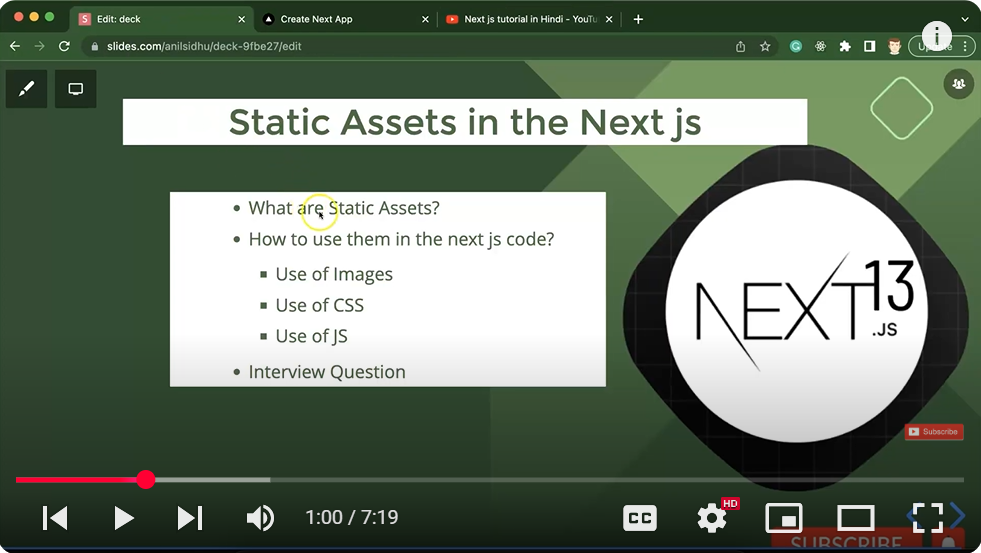
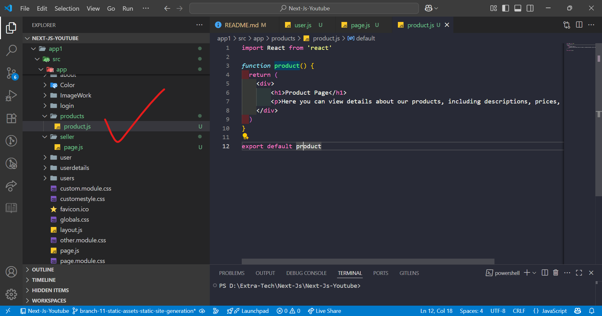
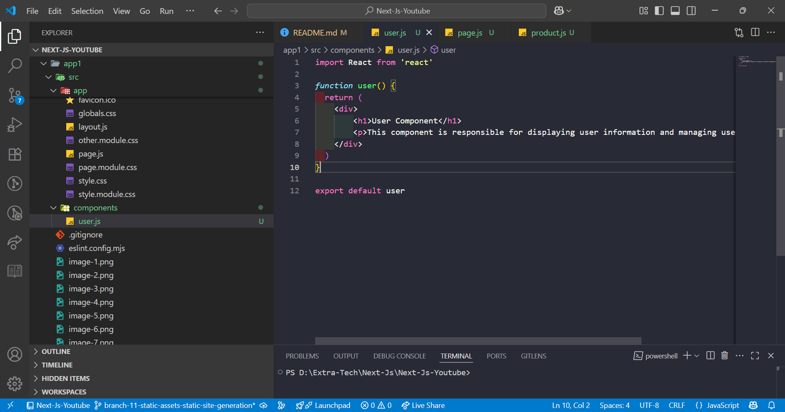
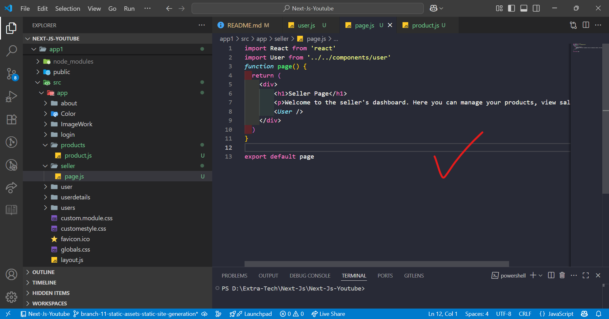
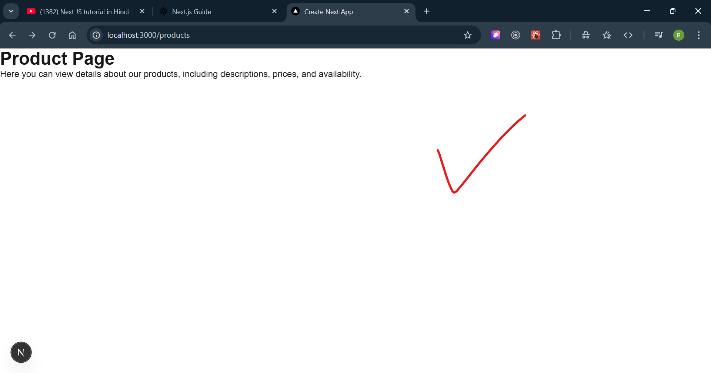
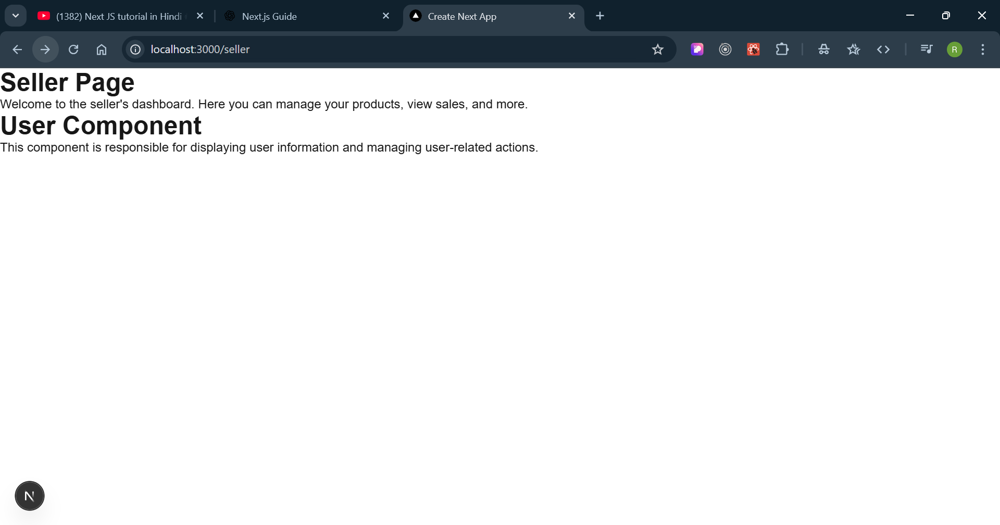
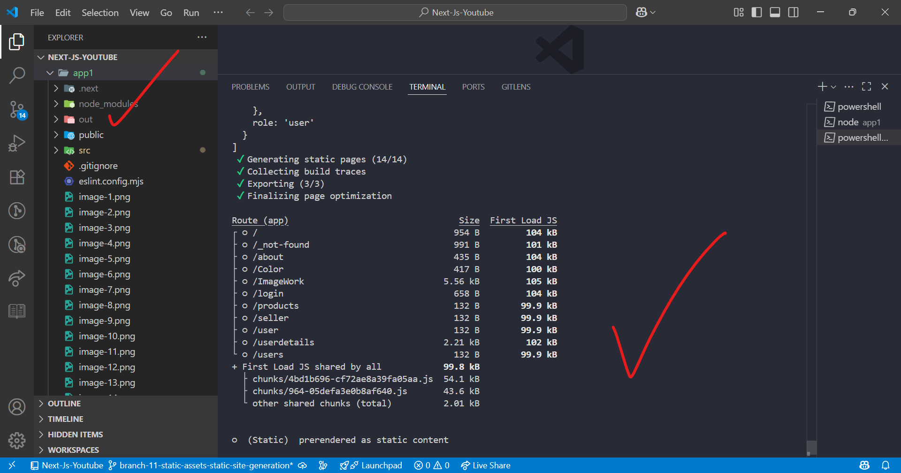

## ------ Next JS tutorial in Hindi #22 CSS Modules with Next.js 13.4 ------
1) 
2) 
In **Next.js**, you can use two main types of CSS:

---

### 🔹 1. **Normal CSS (Global CSS)**

### 🔹 2. **CSS Modules (Scoped CSS)**

Let’s understand both in depth:

---

## ✅ 1. **Normal CSS (Global CSS)**

### 📌 What is it?

Global CSS is applied **to the entire application**. Styles are not scoped to specific components—just like traditional CSS.

### 📁 Where do you put it?

Usually in `styles/globals.css`, but you can have multiple global files.

### 📥 How to use it?

**a. Create a file:**

```bash
/styles/globals.css
```

**b. Add styles:**

```css
/* styles/globals.css */
body {
  margin: 0;
  font-family: Arial, sans-serif;
}

h1 {
  color: red;
}
```

**c. Import it in `_app.js`:**

```js
// pages/_app.js
import '@/styles/globals.css';

export default function App({ Component, pageProps }) {
  return <Component {...pageProps} />;
}
```

### ⚠️ Key Points:

* All components share the same styles.
* Risk of **style conflicts** (e.g., multiple `h1` styles).
* Great for utility, reset styles, fonts, etc.

---

## ✅ 2. **CSS Modules (Scoped CSS)**

### 📌 What is it?

CSS Modules allow you to write styles that are **scoped to a single component**. This prevents class name conflicts.

### 🧠 How it works?

Next.js automatically scopes the class names using **unique hashes**.

### 📥 How to use it?

**a. Create a file with `.module.css`:**

```bash
/components/Button.module.css
```

**b. Add styles:**

```css
/* Button.module.css */
.button {
  background-color: blue;
  color: white;
  padding: 10px;
  border-radius: 5px;
}
```

**c. Use it in the component:**

```js
// components/Button.jsx
import styles from './Button.module.css';

function Button() {
  return <button className={styles.button}>Click Me</button>;
}

export default Button;
```

### ✅ Result:

The class name in the browser becomes something like:

```html
<button class="Button_button__cS5GH">Click Me</button>
```

So styles are **component-specific** and **safe** from conflict.

---

## 🔍 Side-by-side Comparison

| Feature          | Global CSS              | CSS Modules                |
| ---------------- | ----------------------- | -------------------------- |
| File extension   | `.css`                  | `.module.css`              |
| Scope            | Global (entire app)     | Local (specific component) |
| Risk of conflict | High                    | None                       |
| Where to import  | `_app.js`               | Component directly         |
| Usage style      | Class name directly     | `styles.className`         |
| Use case         | Reset, fonts, utilities | Component styling          |

---

## ✅ Example Project Structure

```
/pages
  _app.js
  index.js

/styles
  globals.css

/components
  Button.jsx
  Button.module.css
```

---

## ✅ When to Use What?

| Use Case                                | Recommended Style   |
| --------------------------------------- | ------------------- |
| Styling layout, body, fonts             | Global CSS          |
| Styling individual components           | CSS Modules         |
| Using utility-first CSS (like Tailwind) | Global (via import) |
| Styling third-party UI libraries        | Global              |

---

## 🛑 Common Mistakes to Avoid

1. **Importing `.module.css` in `_app.js`** – won’t work.
2. **Using the wrong class name format** – e.g., writing `className="styles.button"` instead of `className={styles.button}`.
3. **Using global CSS in dynamic imported components** – must be imported only once in `_app.js`.

---

If you’d like, I can give you a working Next.js example project showing both CSS types.


### ----- Next JS tutorial in Hindi #23 Conditional style and CSS IN next.js 13.4----------
1) 
2) 

## ---------  Next JS tutorial in Hindi #25 Font Optimization in next.js 13.4 ----
1) 
2) basically when we use normal way to use the font in project then each time based on page request will 
arise on server from where we are calling the font which make extra network call !! 
3) by using the next js font it won't beacuse it store that one in 'cache' and it won't show in the network tab of browser beacue it woking on the server side not client side. 
4) GO TO google font and select a particular font type
5) 
6) 
7) paste that copyed code into top level of our project that is layout.js file:
8) 
9) 
10) 
11) 
12) 
13) see on the above image no network call and not style applied
14) 
15) 


## --------- Next JS tutorial in Hindi #26 generateMetadata for Dynamic meta data in next.js 13.4 --------
1) 
2) basically there is two types of meta data
  - static meta data: which is already define for all the page as same and bydefault it is defined in layout page.
  - Dynamic meta data: based on page define
3) 
In **Next.js**, metadata is crucial for **SEO (Search Engine Optimization)** and **social sharing**, as it helps define how a page appears in search engines and on social platforms.

---

## ✅ What is Metadata in Next.js?

Metadata refers to HTML `<head>` elements like:

* `<title>`
* `<meta name="description">`
* `<meta property="og:title">` (Open Graph for Facebook)
* `<meta name="twitter:card">` (Twitter cards)
* And more...

---

## 📌 Static Metadata in Next.js

You can define metadata **statically** in a route file like `page.js` or `layout.js` using the `metadata` export.

### Example:

```js
// app/about/page.js
export const metadata = {
  title: "About Us - MyApp",
  description: "Learn more about our company and team.",
};
  
export default function AboutPage() {
  return <h1>About Page</h1>;
}
```

### Result:

This will inject the `<title>` and `<meta>` tags into the `<head>` of the HTML.

---

## ⚡ Dynamic Metadata in Next.js

Use dynamic metadata when values depend on route parameters, API data, or other runtime logic.

### Example using `generateMetadata()`:

```js
// app/blog/[slug]/page.js
export async function generateMetadata({ params }) {
  const post = await fetch(`https://example.com/api/posts/${params.slug}`).then(res => res.json());

  return {
    title: post.title,
    description: post.excerpt,
  };
}

export default function BlogPost({ params }) {
  return <h1>Post: {params.slug}</h1>;
}
```

🔍 `generateMetadata` is an async function and gets `params`, `searchParams`, etc., which allows you to dynamically fetch data and return metadata.

---

## 🔄 Comparison

| Feature       | Static Metadata            | Dynamic Metadata                           |
| ------------- | -------------------------- | ------------------------------------------ |
| Defined using | `export const metadata`    | `export async function generateMetadata()` |
| Use case      | Static titles/descriptions | Dynamic routes, fetched content            |
| SEO-friendly  | ✅                          | ✅ (even more powerful)                     |

---

## 📘 Good Practice

* Use **static metadata** where possible for performance.
* Use **dynamic metadata** for pages like blog posts, products, etc., where content is fetched dynamically.

---

Would you like an example with Open Graph and Twitter meta tags too?

- yes:
Here’s a complete example showing how to add **Open Graph** and **Twitter meta tags** in both **static** and **dynamic metadata** in Next.js:

---

## ✅ Static Metadata Example (in `page.js`)

```js
// app/about/page.js
export const metadata = {
  title: "About Us | MyCompany",
  description: "Discover more about our mission, values, and team.",
  openGraph: {
    title: "About Us | MyCompany",
    description: "Discover more about our mission, values, and team.",
    url: "https://yourdomain.com/about",
    siteName: "MyCompany",
    images: [
      {
        url: "https://yourdomain.com/images/about-og.png",
        width: 1200,
        height: 630,
        alt: "About Us Open Graph Image",
      },
    ],
    type: "website",
  },
  twitter: {
    card: "summary_large_image",
    title: "About Us | MyCompany",
    description: "Discover more about our mission, values, and team.",
    images: ["https://yourdomain.com/images/about-og.png"],
  },
};

export default function AboutPage() {
  return <h1>About Us</h1>;
}
```

---

## ⚡ Dynamic Metadata Example (in `[slug]/page.js`)

```js
// app/blog/[slug]/page.js
export async function generateMetadata({ params }) {
  const post = await fetch(`https://yourapi.com/posts/${params.slug}`).then(res => res.json());

  return {
    title: post.title,
    description: post.excerpt,
    openGraph: {
      title: post.title,
      description: post.excerpt,
      url: `https://yourdomain.com/blog/${params.slug}`,
      siteName: "MyBlog",
      images: [
        {
          url: post.ogImage || "https://yourdomain.com/default-og.png",
          width: 1200,
          height: 630,
          alt: post.title,
        },
      ],
      type: "article",
      publishedTime: post.publishedAt,
    },
    twitter: {
      card: "summary_large_image",
      title: post.title,
      description: post.excerpt,
      images: [post.ogImage || "https://yourdomain.com/default-og.png"],
    },
  };
}

export default function BlogPost({ params }) {
  return <h1>Blog Post: {params.slug}</h1>;
}
```

---

## ✅ Bonus: Supported Metadata Fields in Next.js

Here are some useful metadata keys:

* `title`, `description`
* `openGraph`:

  * `url`, `type`, `images`, `siteName`, `publishedTime`
* `twitter`:

  * `card`, `title`, `description`, `images`
* `robots`: `"index, follow"`
* `icons`: `{ icon: '/favicon.ico' }`

---

Would you like me to show how this metadata appears in the actual HTML (`<head>`) output as well?

- yes: 

Great! Let's look at how **static** and **dynamic metadata** in Next.js translate into the actual HTML `<head>` section (i.e., what gets sent to the browser for SEO and sharing previews).

---

## ✅ 1. Static Metadata HTML Output Example

When you define metadata in `page.js` like this:

```js
export const metadata = {
  title: "About Us | MyCompany",
  description: "Learn about our mission and values.",
  openGraph: {
    title: "About Us | MyCompany",
    description: "Learn about our mission and values.",
    url: "https://yourdomain.com/about",
    siteName: "MyCompany",
    images: [
      {
        url: "https://yourdomain.com/images/about-og.png",
        width: 1200,
        height: 630,
        alt: "About Us Image",
      },
    ],
    type: "website",
  },
  twitter: {
    card: "summary_large_image",
    title: "About Us | MyCompany",
    description: "Learn about our mission and values.",
    images: ["https://yourdomain.com/images/about-og.png"],
  },
};
```

👉 **It produces this in the HTML `<head>`**:

```html
<title>About Us | MyCompany</title>
<meta name="description" content="Learn about our mission and values.">

<!-- Open Graph tags -->
<meta property="og:title" content="About Us | MyCompany">
<meta property="og:description" content="Learn about our mission and values.">
<meta property="og:url" content="https://yourdomain.com/about">
<meta property="og:site_name" content="MyCompany">
<meta property="og:image" content="https://yourdomain.com/images/about-og.png">
<meta property="og:image:width" content="1200">
<meta property="og:image:height" content="630">
<meta property="og:image:alt" content="About Us Image">
<meta property="og:type" content="website">

<!-- Twitter tags -->
<meta name="twitter:card" content="summary_large_image">
<meta name="twitter:title" content="About Us | MyCompany">
<meta name="twitter:description" content="Learn about our mission and values.">
<meta name="twitter:image" content="https://yourdomain.com/images/about-og.png">
```

---

## ⚡ 2. Dynamic Metadata HTML Output Example

If you're using dynamic metadata from an API like this:

```js
export async function generateMetadata({ params }) {
  const post = await fetch(...).then(res => res.json());

  return {
    title: post.title,
    description: post.excerpt,
    openGraph: {
      title: post.title,
      description: post.excerpt,
      url: `https://yourdomain.com/blog/${params.slug}`,
      images: [{ url: post.image }],
      type: "article",
      publishedTime: post.publishedAt,
    },
    twitter: {
      card: "summary_large_image",
      title: post.title,
      description: post.excerpt,
      images: [post.image],
    },
  };
}
```

👉 The HTML output will **change dynamically per blog post**, for example:

```html
<title>How to Learn JavaScript Fast</title>
<meta name="description" content="Get tips on mastering JS quickly.">

<!-- Open Graph -->
<meta property="og:title" content="How to Learn JavaScript Fast">
<meta property="og:description" content="Get tips on mastering JS quickly.">
<meta property="og:url" content="https://yourdomain.com/blog/js-fast">
<meta property="og:image" content="https://yourdomain.com/images/js-post.png">
<meta property="og:type" content="article">
<meta property="article:published_time" content="2025-07-29T18:00:00Z">

<!-- Twitter -->
<meta name="twitter:card" content="summary_large_image">
<meta name="twitter:title" content="How to Learn JavaScript Fast">
<meta name="twitter:description" content="Get tips on mastering JS quickly.">
<meta name="twitter:image" content="https://yourdomain.com/images/js-post.png">
```

---

## 🧠 Why This Matters

These `<meta>` tags help:

* Improve **SEO**
* Control how your page looks when **shared on social media**
* Give **Google & bots** the correct info
* Create dynamic preview cards with correct **images, titles, etc.**

---

Let me know if you'd like a template or ready-to-use SEO component for easier reuse across your pages.

- yes:

Here's a **ready-to-use SEO metadata template** you can add to any page in your **Next.js 13+/App Router** project using `metadata` (static or dynamic).

---

## ✅ Static SEO Template (Re-usable)

If you have common metadata across pages, you can extract it to a file like `lib/seo.js` or `constants/seo.js`.

### `lib/seo.js`

```js
export const defaultMetadata = {
  title: "MyApp - Your Productivity Partner",
  description: "An all-in-one tool to manage your projects, tasks, and time efficiently.",
  keywords: ["productivity", "task manager", "project tracking", "MyApp"],
  authors: [{ name: "Ritik Sharma", url: "https://yourdomain.com" }],
  creator: "MyApp Team",
  openGraph: {
    title: "MyApp - Your Productivity Partner",
    description: "An all-in-one tool to manage your projects, tasks, and time efficiently.",
    url: "https://yourdomain.com",
    siteName: "MyApp",
    images: [
      {
        url: "https://yourdomain.com/images/og-banner.png",
        width: 1200,
        height: 630,
        alt: "MyApp Open Graph Banner",
      },
    ],
    locale: "en_US",
    type: "website",
  },
  twitter: {
    card: "summary_large_image",
    title: "MyApp - Your Productivity Partner",
    description: "Manage your tasks and projects all in one place.",
    images: ["https://yourdomain.com/images/og-banner.png"],
    creator: "@myapp",
  },
  metadataBase: new URL("https://yourdomain.com"),
};
```

---

## 📄 Example Usage in a Static Page

```js
// app/about/page.js
import { defaultMetadata } from "@/lib/seo";

export const metadata = {
  ...defaultMetadata,
  title: "About Us | MyApp",
  description: "Learn more about the team behind MyApp.",
  openGraph: {
    ...defaultMetadata.openGraph,
    title: "About Us | MyApp",
    description: "Learn more about the team behind MyApp.",
    url: "https://yourdomain.com/about",
  },
  twitter: {
    ...defaultMetadata.twitter,
    title: "About Us | MyApp",
    description: "Learn more about the team behind MyApp.",
  },
};

export default function AboutPage() {
  return <div>About Page</div>;
}
```

---

## ⚡ Dynamic SEO Example for Blog

```js
// app/blog/[slug]/page.js

export async function generateMetadata({ params }) {
  const res = await fetch(`https://api.example.com/posts/${params.slug}`);
  const post = await res.json();

  return {
    title: post.title,
    description: post.excerpt,
    openGraph: {
      title: post.title,
      description: post.excerpt,
      url: `https://yourdomain.com/blog/${params.slug}`,
      images: [{ url: post.image }],
      type: "article",
      publishedTime: post.publishedAt,
    },
    twitter: {
      card: "summary_large_image",
      title: post.title,
      description: post.excerpt,
      images: [post.image],
    },
  };
}
```

---

## 🛠 Optional SEO Helpers

You can also add a `robots.txt`, `sitemap.xml`, and structured data via `next-sitemap`.

Would you like help setting up those too?


## ------- Next JS tutorial in Hindi #27 Script component in next.js 13.4 --------

1) 
2) if we use the html script tag in nex js then that will load the respective library in our project as fully means that library will appy on entire project  but while using script component of next js we can make a library to appy on specific page not on all the project page.


## -------------- Next JS tutorial in Hindi #28 Loading Feature | Loader with API data in Next.js 13.4 -----------
1) 
2) 
### 🔄 **Loading Feature in Next.js (App Router)**

In **Next.js 13+ (App Router)**, the **loading feature** provides a **built-in way to handle loading UI** when you're waiting for a route or a part of your application to load.

---

### ✅ **What is it?**

When you navigate to a new route or page, especially if it’s using `async` data fetching (like calling an API), Next.js can **automatically show a loading indicator (UI)** before rendering the final content.

This is done by adding a special file:

```
app/<route>/loading.js
```

---

### 🧠 **How It Works:**

* Create a file called `loading.js` (or `loading.tsx`) inside any route directory.
* Next.js will **automatically render it** while the actual content is being **fetched** or **lazy-loaded**.
* Once data is ready, it **replaces** the loading UI with the actual page content.

---

### 📂 **Example File Structure:**

```
app/
├── users/
│   ├── page.js         ← Actual page
│   ├── loading.js      ← Shown while page.js is loading
```

---

### 📌 **Example Code:**

#### `app/users/page.js`

```jsx
export default async function UsersPage() {
  const res = await fetch("https://dummyjson.com/users");
  const data = await res.json();

  return (
    <div>
      <h1>User List</h1>
      <ul>
        {data.users.map(user => (
          <li key={user.id}>{user.firstName}</li>
        ))}
      </ul>
    </div>
  );
}
```

#### `app/users/loading.js`

```jsx
export default function Loading() {
  return <p>Loading user list...</p>;
}
```

When you go to `/users`, Next.js:

* First shows `loading.js`
* Fetches API data
* Then shows `page.js` content

---

### ✅ **Benefits**

* Built-in and automatic
* No need for state management like `useState/loading`
* Great for improving user experience during slow network/API loads

---

### 🔧 Want to Use a Spinner?

You can replace `loading.js` content with:

```jsx
<div className="spinner"></div>
```

And style it with CSS or use a spinner component.

---

Let me know if you want a loading spinner or skeleton loader added as well.


## ------- Next JS tutorial in Hindi #29 Static Assets in next.js 13.4 -----------
1) when ever we create build of any project then name of files, folder structure of files and folder will change but only for static files and folder name and structure will same as developing...
2) 
3) 
### 📦 What Are **Static Assets** in Next.js?

In **Next.js**, **static assets** are files like **images, JavaScript files, CSS, fonts, videos**, etc., that **don’t need processing by the server** and can be served directly to the client.

These files are usually placed inside the **`public/`** directory of your Next.js project.

---

### ✅ **Why Use Static Assets?**

* Direct access from the browser (no special imports needed).
* Faster load time (served via CDN in production).
* Great for global resources like logos, custom scripts, styles, and media files.

---

## 🔹 1. **Where to Put Static Assets?**

All static files go inside the **`public/`** folder at the **root** of your project.

Example structure:

```
my-next-app/
├── public/
│   ├── images/
│   │   └── logo.png
│   ├── styles/
│   │   └── global.css
│   └── js/
│       └── custom.js
├── app/
├── pages/
└── next.config.js
```

---

## 🔹 2. **Using Static Assets**

### 🖼️ A. **Images**

There are **two ways** to use images:

---

#### ✅ **(i) HTML `` Tag**

```jsx

```

> 🔸 Path starts from the `public/` folder (no need to write `public/` in the path).

---

#### ✅ **(ii) Next.js `<Image>` Component (Recommended)**

```jsx
import Image from 'next/image';

export default function Home() {
  return (
    <Image src="/images/logo.png" alt="Logo" width={200} height={100} />
  );
}
```

* Optimizes images (responsive, lazy loading, etc.)
* Must provide `width` and `height` or `fill` for layout

---

### 🧑‍💻 B. **Custom JavaScript**

Put your JS file in `public/js/custom.js`, then use it via a script tag:

```html
<script src="/js/custom.js"></script>
```

Or use the Next.js `<Script>` component:

```jsx
import Script from "next/script";

export default function Page() {
  return (
    <>
      <Script src="/js/custom.js" strategy="afterInteractive" />
    </>
  );
}
```

> 📌 `strategy="afterInteractive"` ensures it loads **after page is interactive**.

---

### 🎨 C. **CSS**

If you have a custom global stylesheet:

#### Add CSS to `public/styles/global.css`

Then import it in your root layout or `_app.js`:

```js
import '../public/styles/global.css'
```

> ⚠️ However, it’s **better to keep global styles in the `styles/` folder (not `public/`)** for easier import.

---

### 🔔 Notes:

* Assets inside `public/` are served at the root URL.
* For example, `public/images/pic.jpg` is available at `http://localhost:3000/images/pic.jpg`.

---

## 💡 Best Practices

| Asset Type    | Location                      | Usage                                         |
| ------------- | ----------------------------- | --------------------------------------------- |
| Images        | `public/images/`              | `` or `<Image />` |
| CSS           | `public/styles/` or `styles/` | Global import or scoped in components         |
| JS            | `public/js/`                  | `<script src="/js/script.js">`                |
| Fonts, Videos | `public/fonts/`, etc.         | Link via `<link>` or CSS `@font-face`         |

---

### ✅ Example in Layout

```jsx
import Image from 'next/image';
import Script from 'next/script';
import '../styles/global.css';

export default function Home() {
  return (
    <div>
      <Image src="/images/logo.png" alt="Logo" width={100} height={50} />

      <Script src="/js/custom.js" strategy="afterInteractive" />

      <h1>Hello from Next.js!</h1>
    </div>
  );
}
```

---

Let me know if you'd like a **live example** or want to **include fonts/videos** too.
   - yes:
### ✅ Static Assets in Next.js — Full Guide

Next.js provides a convenient way to serve **static files** such as images, JavaScript files, stylesheets (CSS), fonts, etc. These are files that do not require server-side processing and can be directly accessed by the browser.

---

### 📁 Where to Store Static Files

You should place all your static files inside the **`public/`** folder at the root of your Next.js project.

```
my-next-app/
├── public/
│   ├── images/
│   │   └── logo.png
│   ├── scripts/
│   │   └── example.js
│   ├── styles/
│   │   └── global.css
│   └── favicon.ico
```

---

### ✅ How to Use Static Assets

---

#### 🔹 1. **Images** (`.png`, `.jpg`, `.svg`, etc.)

**Using HTML ``:**

```jsx

```

**Using Next.js `next/image`:**

```jsx
import Image from 'next/image';

export default function Home() {
  return (
    <Image
      src="/images/logo.png" // must start with `/`
      alt="Logo"
      width={300}
      height={200}
    />
  );
}
```

✅ `next/image` optimizes the image automatically for performance and responsiveness.

---

#### 🔹 2. **CSS Files**

You can use global CSS by importing it inside `pages/_app.js` (or `app/layout.js` if you're using App Router):

**File: `public/styles/global.css`**

```css
body {
  background-color: #f0f0f0;
  font-family: Arial, sans-serif;
}
```

**Usage in `_app.js`:**

```jsx
import '../public/styles/global.css'; // path from root

export default function App({ Component, pageProps }) {
  return <Component {...pageProps} />;
}
```

> ✅ You can also use `module.css` files for component-scoped CSS.

---

#### 🔹 3. **JavaScript Files**

Place your JS files in `/public/scripts/`:

**File: `public/scripts/example.js`**

```js
console.log("This is an external script!");
```

**Usage in `head`:**

```jsx
import Script from 'next/script';

export default function Page() {
  return (
    <>
      <Script src="/scripts/example.js" strategy="lazyOnload" />
      <h1>Hello World</h1>
    </>
  );
}
```

---

#### 🔹 4. **Other Assets (e.g. fonts, docs)**

You can store any static file (PDFs, text files, fonts, etc.) inside `/public` and access it via:

```
http://localhost:3000/fonts/myfont.ttf
http://localhost:3000/docs/resume.pdf
```

---

### 💡 Notes:

* Static assets under `public/` are **served at the root path**:
  `/public/images/pic.png` → accessible at `/images/pic.png`.

* Avoid importing files from `public/` using `import`; instead use them via URLs in JSX or HTML.

* Files inside `public/` are **not processed** by Webpack — they're directly copied to the final build.

---

### 📦 Best Practices

* ✅ Use `next/image` for responsive, optimized images.
* ✅ Use `Script` from `next/script` for external JS with control over loading strategy.
* ❌ Don't import from `public/` using `import` — use URL paths instead.

---

## ----------- Next JS tutorial in Hindi #30 How to make Production Build in next.js 13.4 ---------
1) 
2) product build take less time(faster) and less size while  development build take more time(slower) and more size compare to production build because in the production code are minified and the development code are not minified because if we do it then to do the debuggle it will hard for that!!!
3) Question: what is build and type of build and there role each all give me 
 - ans:
 Great question! Let's break down the concept of **build** in **Next.js**, the **types of builds**, and the **role of each** type — all in a beginner-to-advanced-friendly way.

---

## ✅ What is "Build" in Next.js?

In **Next.js**, the term **"build"** refers to the process of converting your source code into optimized, production-ready output — including **HTML**, **CSS**, **JavaScript**, and **static assets**.

This is done using:

```bash
npm run build
# or
yarn build
```

---

## 📦 What Happens During a Build?

1. **Compiles your code** (TypeScript/JSX to JS)
2. **Optimizes** static files
3. **Generates static HTML** for pages that can be pre-rendered
4. **Creates server-rendered pages** (if needed)
5. **Prepares** your app for deployment to Vercel or any hosting

---

## 🚀 Types of Builds in Next.js

| Type                                         | Description                                                             | Example Use                                      |
| -------------------------------------------- | ----------------------------------------------------------------------- | ------------------------------------------------ |
| 1. **Static Site Generation (SSG)**          | Pages are pre-rendered at build time into HTML                          | Blogs, Documentation                             |
| 2. **Server Side Rendering (SSR)**           | Pages are rendered on-demand at request time on the server              | Dashboard, Admin Panel                           |
| 3. **Client Side Rendering (CSR)**           | Pages are rendered completely on the client using JS                    | SPA-like experiences                             |
| 4. **Incremental Static Regeneration (ISR)** | Combines SSG and SSR: pages are regenerated **after build** when needed | Dynamic blogs/products with low change frequency |

---

### 🔹 1. Static Site Generation (SSG)

* Runs at **build time**
* Fastest performance
* SEO-friendly
* Uses `getStaticProps` and optionally `getStaticPaths`

```js
export async function getStaticProps() {
  const data = await fetchData();
  return { props: { data } };
}
```

**Role:** Best for content that doesn't change often (e.g., blogs, marketing pages).

---

### 🔹 2. Server Side Rendering (SSR)

* Runs on **every request**
* Uses `getServerSideProps`

```js
export async function getServerSideProps() {
  const data = await fetchData();
  return { props: { data } };
}
```

**Role:** Use when content changes frequently or is personalized (e.g., dashboards, live data).

---

### 🔹 3. Client Side Rendering (CSR)

* No data fetched at build or server time
* Fetches data after component mounts using `useEffect`

```js
useEffect(() => {
  fetch('/api/data').then(...);
}, []);
```

**Role:** Suitable for dynamic or private data after authentication.

---

### 🔹 4. Incremental Static Regeneration (ISR)

* Allows you to update static pages **after** deployment
* Uses `revalidate` field in `getStaticProps`

```js
export async function getStaticProps() {
  const data = await fetchData();
  return {
    props: { data },
    revalidate: 10, // Regenerate the page every 10 seconds
  };
}
```

**Role:** Best of both worlds — static performance + dynamic updates.

---

## ⚙️ Build Output (After Running `npm run build`)

You’ll see:

* `.next/` folder — build output
* Static pages → `out/` (if you export)
* Server functions bundled
* Optimized assets (JS, CSS, images)

---

## 🧱 Summary Table

| Build Type | Pre-render | When Built         | Use Case            |
| ---------- | ---------- | ------------------ | ------------------- |
| SSG        | ✅ Yes      | Build time         | Blogs, Docs         |
| SSR        | ✅ Yes      | Runtime            | Dashboards          |
| CSR        | ❌ No       | Client             | Auth-only apps      |
| ISR        | ✅ Yes      | Build + Revalidate | Ecommerce, Products |

---

## 📌 Command Cheatsheet

| Command           | Description                      |
| ----------------- | -------------------------------- |
| `npm run dev`     | Run in development mode          |
| `npm run build`   | Create production build          |
| `npm run start`   | Start production server          |
| `npx next export` | Export to static HTML (optional) |

---

Would you like a demo project to see all 4 build types in action?
 - yes:
In **Next.js**, a **build** refers to the process of converting your application’s source code (React components, styles, assets, etc.) into optimized and production-ready output. During this phase, Next.js generates HTML, CSS, JavaScript bundles, and other necessary files for deployment.

---

### 🔧 **What Happens During `next build`?**

When you run `next build`, Next.js:

1. Compiles your code using Webpack and Babel.
2. Optimizes and minifies JavaScript and CSS.
3. Performs tree-shaking (removing unused code).
4. Analyzes and builds your pages using the rendering strategy you've defined (static or server).
5. Generates static assets for public hosting.
6. Outputs everything into the `.next` folder.

---

### 🏗️ **Types of Build Outputs in Next.js**

Each page can be rendered in different ways during the build:

#### 1. **Static Generation (SSG - Static Site Generation)**

* Generated at **build time**.
* Output: HTML + JSON.
* Fastest performance, best for public pages.
* Example:

  ```js
  export async function getStaticProps() {
    const data = await fetchData();
    return { props: { data } };
  }
  ```

#### 2. **Server-Side Rendering (SSR)**

* Rendered **on each request** at runtime.
* Example:

  ```js
  export async function getServerSideProps() {
    const data = await fetchData();
    return { props: { data } };
  }
  ```

#### 3. **Static Generation with ISR (Incremental Static Regeneration)**

* Built statically but **can be revalidated** after a set interval.
* Keeps static performance with fresh data.
* Example:

  ```js
  export async function getStaticProps() {
    const data = await fetchData();
    return {
      props: { data },
      revalidate: 60, // seconds
    };
  }
  ```

#### 4. **Client-Side Rendering (CSR)**

* Page is **fully rendered in the browser** using React.
* No build-time generation or SSR.
* You fetch data inside `useEffect`.

---

### 📦 `.next` Build Output Folder Structure

After running `next build`, you get:

| Folder/File      | Description                                    |
| ---------------- | ---------------------------------------------- |
| `.next/static/`  | Optimized static JS and CSS files              |
| `.next/server/`  | Server functions (SSR, API routes, middleware) |
| `.next/cache/`   | Caching info to speed up builds                |
| `.next/BUILD_ID` | Unique ID of the current build                 |

---

### 🛠️ Running the Build

```bash
npm run build
```

This will output:

* Server-rendered pages
* Static pages
* Optimized assets

---

### 🌐 Deployment

After building, you run:

```bash
npm start
```

It starts a **Node.js server** using the `.next` output.

For Vercel, Netlify, or other platforms, the build is auto-triggered and used for deployment.

---

### 🚀 Summary

| Type | When Rendered      | Suitable For               | Key Function                       |
| ---- | ------------------ | -------------------------- | ---------------------------------- |
| SSG  | Build time         | Blogs, Marketing pages     | `getStaticProps`, `getStaticPaths` |
| SSR  | Request time       | Auth, Dynamic data         | `getServerSideProps`               |
| ISR  | Build + Revalidate | Mix of Static + Dynamic    | `revalidate` with `getStaticProps` |
| CSR  | Browser only       | Private/dynamic dashboards | `useEffect` for data fetching      |

---

Would you like a diagram or notes file for these?

Here's a **full detailed note** on **Next.js Build Process, Types of Builds, and Their Roles**, neatly organized for your reference.

---

## 📦 Next.js Build and Its Types – Complete Notes

---

### 🔧 What is a Build in Next.js?

A **build** in Next.js is the process of transforming source code into a production-ready application. It:

* Compiles React code using Webpack and Babel.
* Optimizes static assets (CSS, JS, images).
* Generates HTML pages.
* Prepares server-side or static rendering for deployment.

---

### 🏗️ Types of Builds in Next.js

---

### 1️⃣ **Static Generation (SSG)**

* Pages are pre-rendered **at build time**.
* Ideal for static content like blogs, marketing sites.
* Fastest method—no server processing on request.

#### 🔹 Functions Used:

```js
export async function getStaticProps() {
  return {
    props: {
      data: 'some static data',
    },
  };
}
```

```js
export async function getStaticPaths() {
  return {
    paths: [{ params: { id: '1' } }],
    fallback: false,
  };
}
```

---

### 2️⃣ **Server-Side Rendering (SSR)**

* Page is rendered **on every request**.
* Suitable for dynamic, real-time content (e.g., user dashboards).

#### 🔹 Function Used:

```js
export async function getServerSideProps(context) {
  const data = await fetchData();
  return { props: { data } };
}
```

---

### 3️⃣ **Incremental Static Regeneration (ISR)**

* Pre-renders like SSG, but **can update** at runtime.
* Keeps the static speed with dynamic content.

#### 🔹 Example:

```js
export async function getStaticProps() {
  const data = await fetchData();
  return {
    props: { data },
    revalidate: 60, // seconds
  };
}
```

---

### 4️⃣ **Client-Side Rendering (CSR)**

* Entire rendering is done **in the browser**.
* Used when data is only needed on the client (e.g., user profile).

#### 🔹 Example:

```js
import { useEffect, useState } from 'react';

export default function Profile() {
  const [data, setData] = useState(null);

  useEffect(() => {
    fetch('/api/profile').then(res => res.json()).then(setData);
  }, []);

  return <div>{data ? data.name : 'Loading...'}</div>;
}
```

---

## 📂 `.next/` Folder – Build Output

| File/Folder                  | Purpose                                       |
| ---------------------------- | --------------------------------------------- |
| `.next/static/`              | Compiled JS, CSS, and static chunks           |
| `.next/server/`              | Server-side functions (SSR, middleware, APIs) |
| `.next/cache/`               | Cache used for faster rebuilds                |
| `.next/BUILD_ID`             | Unique identifier for each build              |
| `.next/routes-manifest.json` | Routes and rewrites info                      |

---

## 📜 Running the Build

```bash
npm run build
```

This will:

* Analyze the app.
* Generate SSG pages.
* Compile server code for SSR.
* Optimize and minify output.

Then use:

```bash
npm start
```

To launch the production server using the generated build.

---

## ✅ Summary Table

| Rendering Method | Render Time        | Use Case                 | Key Method(s)                      |
| ---------------- | ------------------ | ------------------------ | ---------------------------------- |
| SSG              | Build time         | Blogs, static pages      | `getStaticProps`, `getStaticPaths` |
| SSR              | On request         | Auth, dashboards         | `getServerSideProps`               |
| ISR              | Build + revalidate | Mixed content            | `revalidate` with `getStaticProps` |
| CSR              | Client-side        | Private data, form pages | `useEffect`                        |

---

If you’d like this as a **PDF file** or **visual diagram**, let me know—I'll generate and send it.

## ---------- Next JS tutorial in Hindi #31 Export Static HTML Page with Build in Next.js 13.4 -----------------
1) 
2) 
3) 
4) 
5) 
6) then run the command as: npm run build

```
Failed to compile.

./src/app/ImageWork/page.js
14:9  Warning: Using `` could result in slower LCP and higher bandwidth. Consider using `<Image />` from `next/image` or a custom image loader to automatically optimize images. This may incur additional usage or cost from your provider. See: https://nextjs.org/docs/messages/no-img-element  @next/next/no-img-element

./src/app/seller/page.js
7:33  Error: `'` can be escaped with `&apos;`, `&lsquo;`, `&#39;`, `&rsquo;`.  react/no-unescaped-entities

./src/app/users/page.js
20:21  Error: Missing "key" prop for element in iterator  react/jsx-key

info  - Need to disable some ESLint rules? Learn more here: https://nextjs.org/docs/app/api-reference/config/eslint#disabling-rules


 - solution:
 
 You're facing two different issues from ESLint in your **Next.js app**, and both are simple to fix.

---

### ✅ **1. Warning: `` tag used – Use `next/image`**

**File:** `ImageWork/page.js`
**Issue:**
You are using a regular HTML `` tag, which is not recommended in Next.js because it's **not optimized** for performance.

**ESLint Message:**

```
Warning: Using  could result in slower LCP... Use <Image /> from next/image
```

**✅ Solution:**
Replace this line:

```jsx

```

With this:

```jsx
<Image src={Profile} alt="Profile Image" width={200} height={200} />
```

Or, if you're using an external image:
Make sure `next.config.js` has the domain added:

```js
// next.config.js
module.exports = {
  images: {
    domains: ['cdn.britannica.com'],
  },
};
```

---

### ✅ **2. Error: Unescaped apostrophe**

**File:** `seller/page.js`
**Issue:**
JSX doesn't allow unescaped `'` characters in text.
This string causes the problem:

```jsx
<p>Welcome to the seller's dashboard...</p>
```

**ESLint Error:**

```
' can be escaped with &apos;, &lsquo;, &#39;, &rsquo;
```

**✅ Solution:** Escape the `'` using `&apos;` or just use double quotes in a string like this:

```jsx
<p>Welcome to the seller&apos;s dashboard. Here you can manage your products, view sales, and more.</p>
```

---

### ✅ Bonus Fix – Clean `ImageWork` File

```jsx
import Image from 'next/image';
import React from 'react';
import Profile from '../../../public/next.svg';

function ImageWork() {
  return (
    <main>
      <h2>ImageWork Page</h2>

      <Image src={Profile} alt='demo' />
      <Image src={Profile} width={200} height={200} alt='Profile Image' />

      <p>Image component from next/image is optimized for performance.</p>

      <Image
        src='https://cdn.britannica.com/94/494-050-A674AD3A/Fallow-deer-dama-dama.jpg?w=300'
        width={200}
        height={200}
        alt='demo-2'
      />
    </main>
  );
}

export default ImageWork;
```

---
11) 

Q: Export Static HTML Page with Build in next js
- ans: 
Exporting a **static HTML site** with **Next.js** means building your project so it generates **only static files** (HTML, CSS, JS) without any server-side code.

---

## ✅ When to Use Static HTML Export

* You don’t need **server-side rendering**.
* Your site only uses **static generation (SSG)** or **client-side rendering (CSR)**.
* Ideal for blogs, portfolios, documentation, or simple marketing pages.

---

## 📦 Steps to Export Static HTML in Next.js

---

### 🔧 1. Update `next.config.js`

```js
// next.config.js
module.exports = {
  output: 'export', // Enables static HTML export
};
```

---

### 🗂️ 2. Use Only SSG or CSR

⚠️ **Avoid** using:

* `getServerSideProps()` (SSR)
* Middleware (e.g., Edge Functions)
* Dynamic API routes (`/api/*`)

✅ You can use:

* `getStaticProps()`
* `getStaticPaths()`
* Client-side rendering (`useEffect`, etc.)

---

### 📁 3. Add a `404.html` (optional)

Next.js will generate a static `404.html` automatically, but you can customize it in `pages/404.js`.

---

### 🏗️ 4. Run Build and Export

Run the following in your terminal:

```bash
npm run build
npm run export
```

It will:

* Generate HTML files
* Output to the `out/` folder

---

### 📁 5. Deploy the `out/` Directory

Now, the `out/` directory contains your **fully static website**, which you can:

* Host on GitHub Pages, Netlify, Vercel (static mode), Firebase Hosting, etc.
* Serve via any static file server (like Nginx)

---

### 📝 Example: Static Page with `getStaticProps()`

```js
// pages/index.js
export async function getStaticProps() {
  return {
    props: {
      name: 'Ritik Sharma',
    },
  };
}

export default function Home({ name }) {
  return <h1>Hello {name} - Static HTML Export</h1>;
}
```

---

### 📁 Directory Structure After Export

```
/out
  └── index.html
  └── _next/
  └── about/index.html
  └── 404.html
```

---

### ✅ Pros of Static Export

* Super fast: HTML is served instantly.
* Zero server cost.
* Can be hosted anywhere.

---

### ❌ Limitations

* No SSR or API routes.
* No dynamic middleware or auth logic.

---

Let me know if you'd like a **complete starter template** or demo for static HTML export.

 - yes:
 Here’s a **complete working starter template** to demonstrate **Static HTML Export in Next.js**, including:

✅ Static pages
✅ Static props
✅ 404 page
✅ CSS styling
✅ Ready for `next export`

---

## 📁 Project Structure

```
next-static-export-demo/
├── pages/
│   ├── index.js
│   ├── about.js
│   └── 404.js
├── public/
│   └── logo.png
├── styles/
│   └── global.css
├── next.config.js
├── package.json
└── README.md
```

---

## 📦 1. `package.json`

```json
{
  "name": "next-static-export-demo",
  "version": "1.0.0",
  "scripts": {
    "dev": "next dev",
    "build": "next build",
    "export": "next export",
    "start": "serve out"
  },
  "dependencies": {
    "next": "latest",
    "react": "latest",
    "react-dom": "latest",
    "serve": "^14.2.0"
  }
}
```

---

## ⚙️ 2. `next.config.js`

```js
// next.config.js
module.exports = {
  output: 'export', // enables static HTML export
};
```

---

## 🌍 3. `pages/index.js`

```js
export async function getStaticProps() {
  return {
    props: {
      name: 'Ritik Sharma',
    },
  };
}

export default function Home({ name }) {
  return (
    <div>
      <h1>Welcome, {name}!</h1>
      <p>This is a static homepage.</p>
      
    </div>
  );
}
```

---

## 📄 4. `pages/about.js`

```js
export default function About() {
  return (
    <div>
      <h1>About Page</h1>
      <p>This is a static about page exported as HTML.</p>
    </div>
  );
}
```

---

## ❌ 5. `pages/404.js`

```js
export default function Custom404() {
  return (
    <div>
      <h1>404 - Page Not Found</h1>
      <p>The page you are looking for doesn’t exist.</p>
    </div>
  );
}
```

---

## 🖼️ 6. `public/logo.png`

> Add any small image named `logo.png` to the `public/` folder for testing.

---

## 🎨 7. `styles/global.css`

```css
body {
  font-family: Arial, sans-serif;
  margin: 20px;
  padding: 0;
  background-color: #f4f4f4;
}
```

And import this file in `_app.js` (optional for global styles):

```js
// pages/_app.js
import '../styles/global.css';

export default function App({ Component, pageProps }) {
  return <Component {...pageProps} />;
}
```

---

## ▶️ How to Run

```bash
npm install      # Install dependencies
npm run build    # Build the app
npm run export   # Export static HTML to /out
npm run start    # Serve the /out folder
```

Your static site is now live at: `http://localhost:3000`

---

## ✅ Output (in `/out` folder)

```
out/
├── index.html
├── about/index.html
├── 404.html
├── _next/
└── logo.png
```

---

## -------------- Next JS tutorial in Hindi #32 Static Site Generation (SSG) in Next.js 13.4 -----
