## ------ Next JS tutorial in Hindi #22 CSS Modules with Next.js 13.4 ------
1) 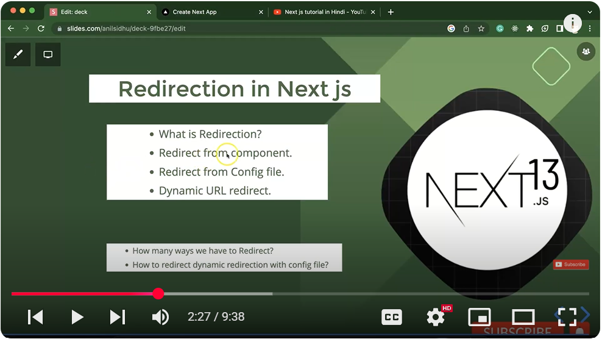
2) 
In **Next.js**, you can use two main types of CSS:

---

### 🔹 1. **Normal CSS (Global CSS)**

### 🔹 2. **CSS Modules (Scoped CSS)**

Let’s understand both in depth:

---

## ✅ 1. **Normal CSS (Global CSS)**

### 📌 What is it?

Global CSS is applied **to the entire application**. Styles are not scoped to specific components—just like traditional CSS.

### 📁 Where do you put it?

Usually in `styles/globals.css`, but you can have multiple global files.

### 📥 How to use it?

**a. Create a file:**

```bash
/styles/globals.css
```

**b. Add styles:**

```css
/* styles/globals.css */
body {
  margin: 0;
  font-family: Arial, sans-serif;
}

h1 {
  color: red;
}
```

**c. Import it in `_app.js`:**

```js
// pages/_app.js
import '@/styles/globals.css';

export default function App({ Component, pageProps }) {
  return <Component {...pageProps} />;
}
```

### ⚠️ Key Points:

* All components share the same styles.
* Risk of **style conflicts** (e.g., multiple `h1` styles).
* Great for utility, reset styles, fonts, etc.

---

## ✅ 2. **CSS Modules (Scoped CSS)**

### 📌 What is it?

CSS Modules allow you to write styles that are **scoped to a single component**. This prevents class name conflicts.

### 🧠 How it works?

Next.js automatically scopes the class names using **unique hashes**.

### 📥 How to use it?

**a. Create a file with `.module.css`:**

```bash
/components/Button.module.css
```

**b. Add styles:**

```css
/* Button.module.css */
.button {
  background-color: blue;
  color: white;
  padding: 10px;
  border-radius: 5px;
}
```

**c. Use it in the component:**

```js
// components/Button.jsx
import styles from './Button.module.css';

function Button() {
  return <button className={styles.button}>Click Me</button>;
}

export default Button;
```

### ✅ Result:

The class name in the browser becomes something like:

```html
<button class="Button_button__cS5GH">Click Me</button>
```

So styles are **component-specific** and **safe** from conflict.

---

## 🔍 Side-by-side Comparison

| Feature          | Global CSS              | CSS Modules                |
| ---------------- | ----------------------- | -------------------------- |
| File extension   | `.css`                  | `.module.css`              |
| Scope            | Global (entire app)     | Local (specific component) |
| Risk of conflict | High                    | None                       |
| Where to import  | `_app.js`               | Component directly         |
| Usage style      | Class name directly     | `styles.className`         |
| Use case         | Reset, fonts, utilities | Component styling          |

---

## ✅ Example Project Structure

```
/pages
  _app.js
  index.js

/styles
  globals.css

/components
  Button.jsx
  Button.module.css
```

---

## ✅ When to Use What?

| Use Case                                | Recommended Style   |
| --------------------------------------- | ------------------- |
| Styling layout, body, fonts             | Global CSS          |
| Styling individual components           | CSS Modules         |
| Using utility-first CSS (like Tailwind) | Global (via import) |
| Styling third-party UI libraries        | Global              |

---

## 🛑 Common Mistakes to Avoid

1. **Importing `.module.css` in `_app.js`** – won’t work.
2. **Using the wrong class name format** – e.g., writing `className="styles.button"` instead of `className={styles.button}`.
3. **Using global CSS in dynamic imported components** – must be imported only once in `_app.js`.

---

If you’d like, I can give you a working Next.js example project showing both CSS types.


### ----- Next JS tutorial in Hindi #23 Conditional style and CSS IN next.js 13.4----------
1) 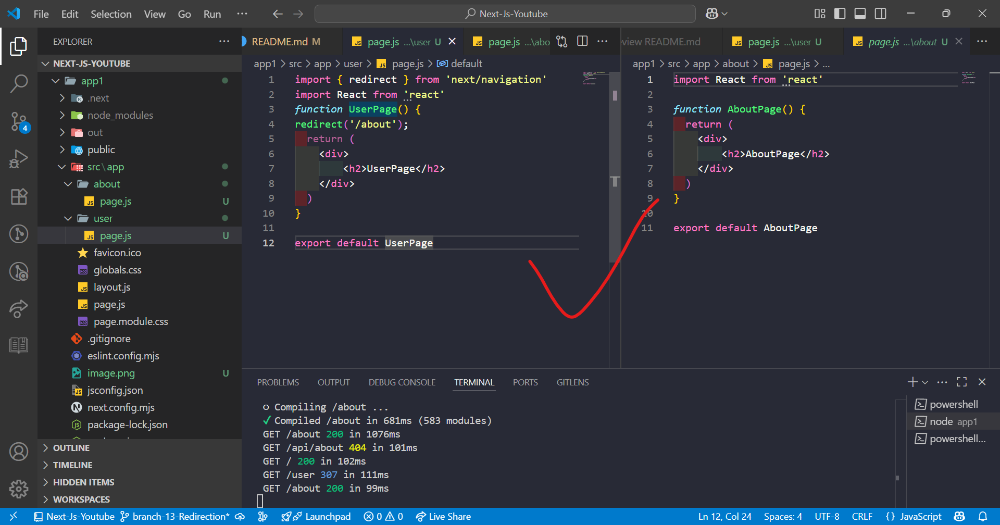
2) 

## ---------  Next JS tutorial in Hindi #25 Font Optimization in next.js 13.4 ----
1) 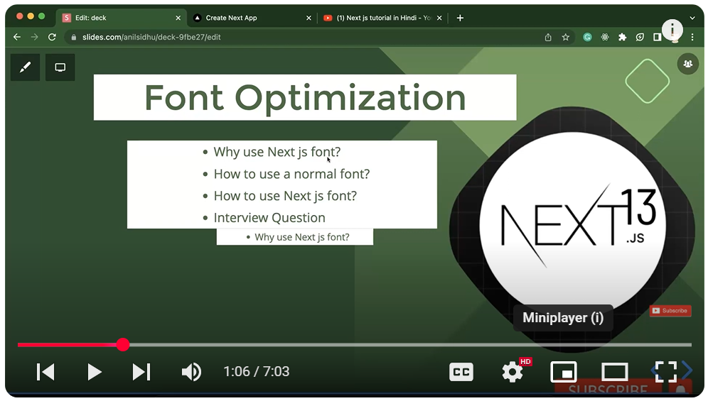
2) basically when we use normal way to use the font in project then each time based on page request will 
arise on server from where we are calling the font which make extra network call !! 
3) by using the next js font it won't beacuse it store that one in 'cache' and it won't show in the network tab of browser beacue it woking on the server side not client side. 
4) GO TO google font and select a particular font type
5) 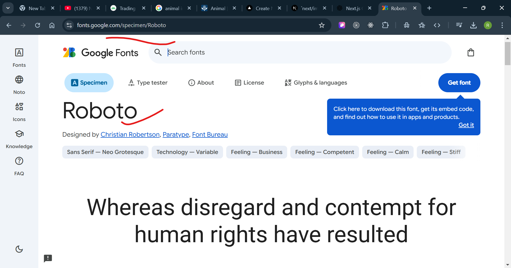
6) 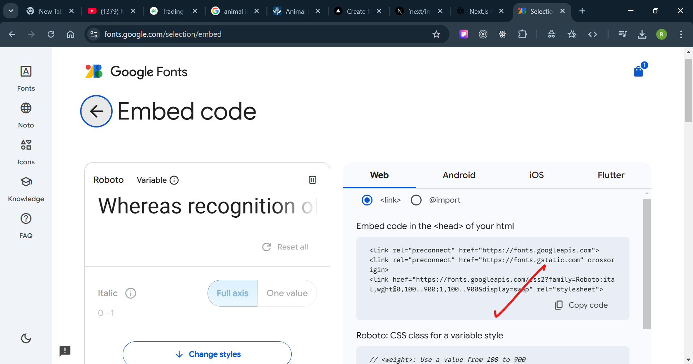
7) paste that copyed code into top level of our project that is layout.js file:
8) 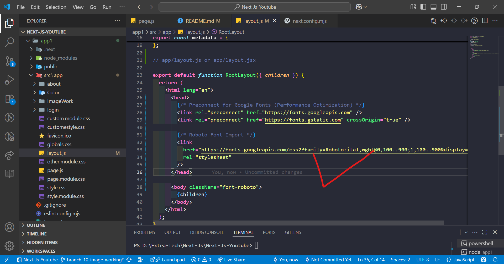
9) 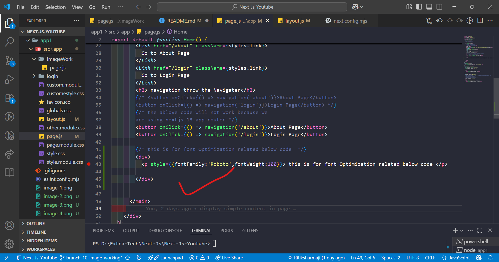
10) 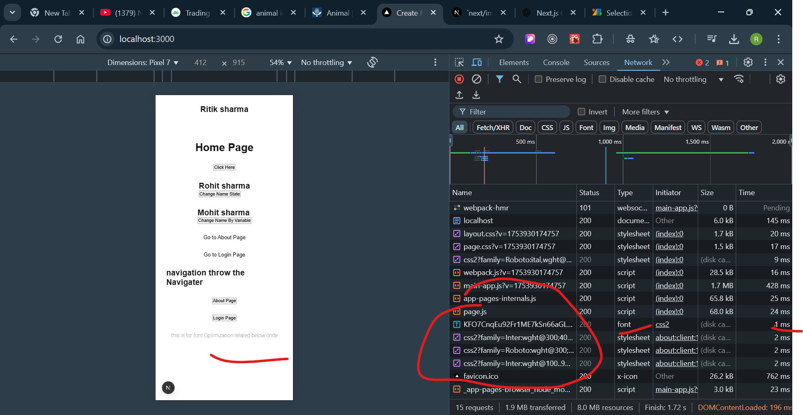
11) 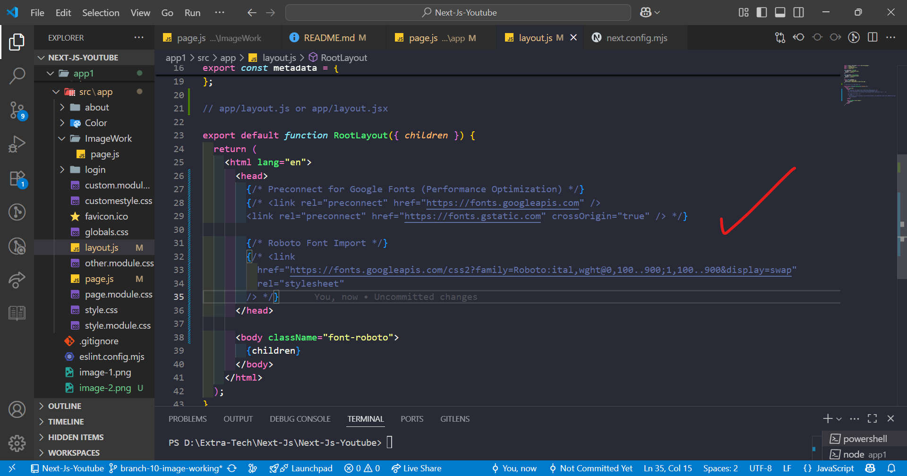
12) 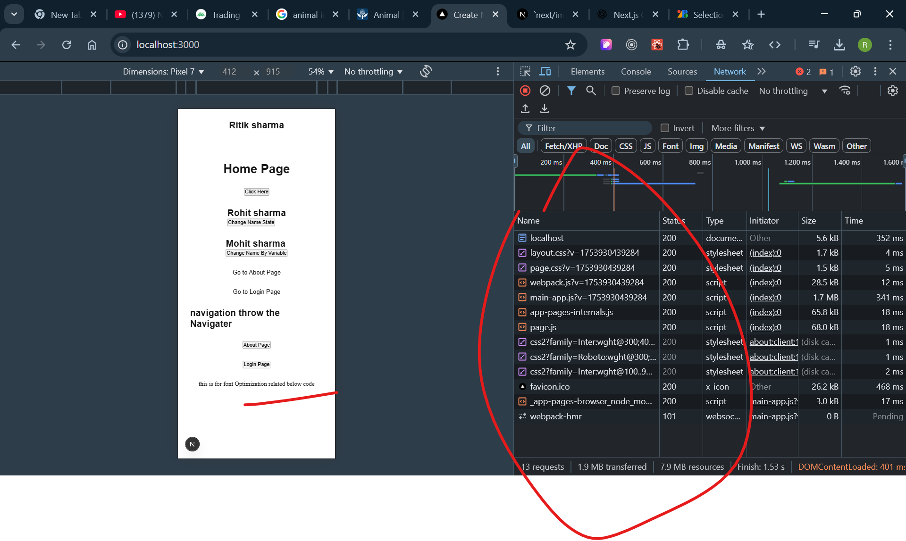
13) see on the above image no network call and not style applied
14) 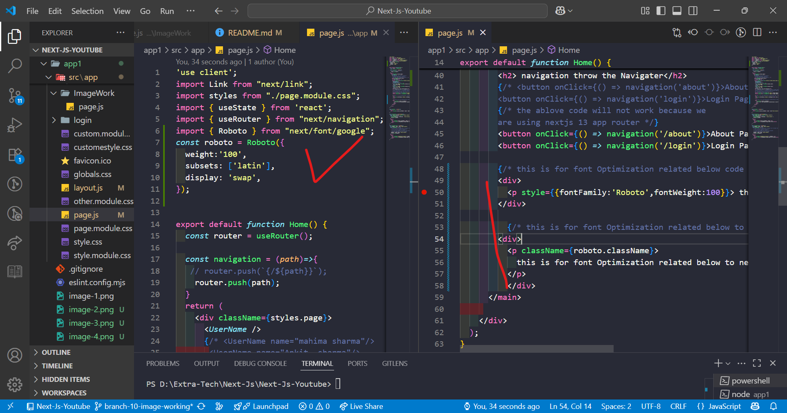
15) 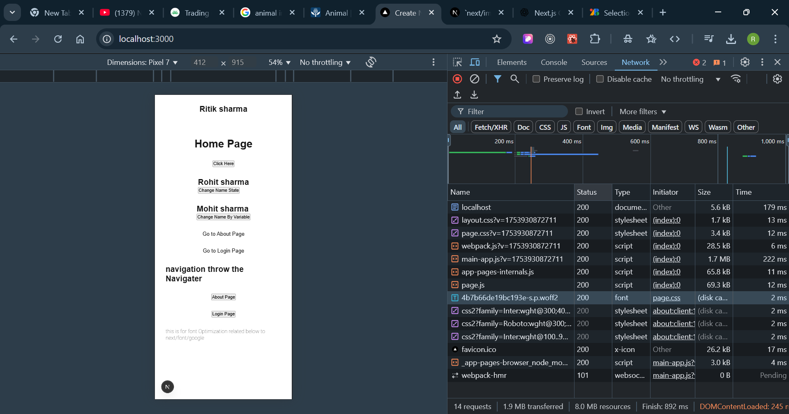


## --------- Next JS tutorial in Hindi #26 generateMetadata for Dynamic meta data in next.js 13.4 --------
1) 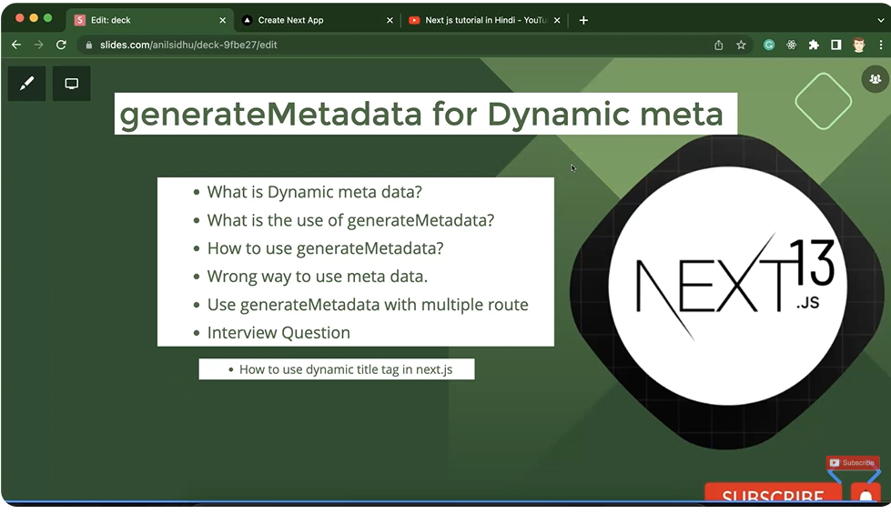
2) 